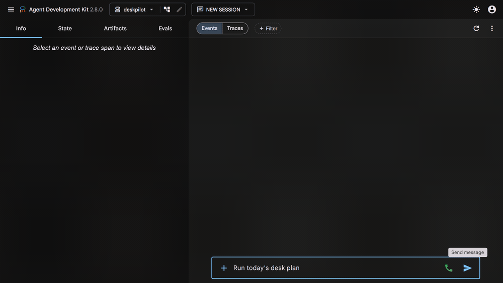
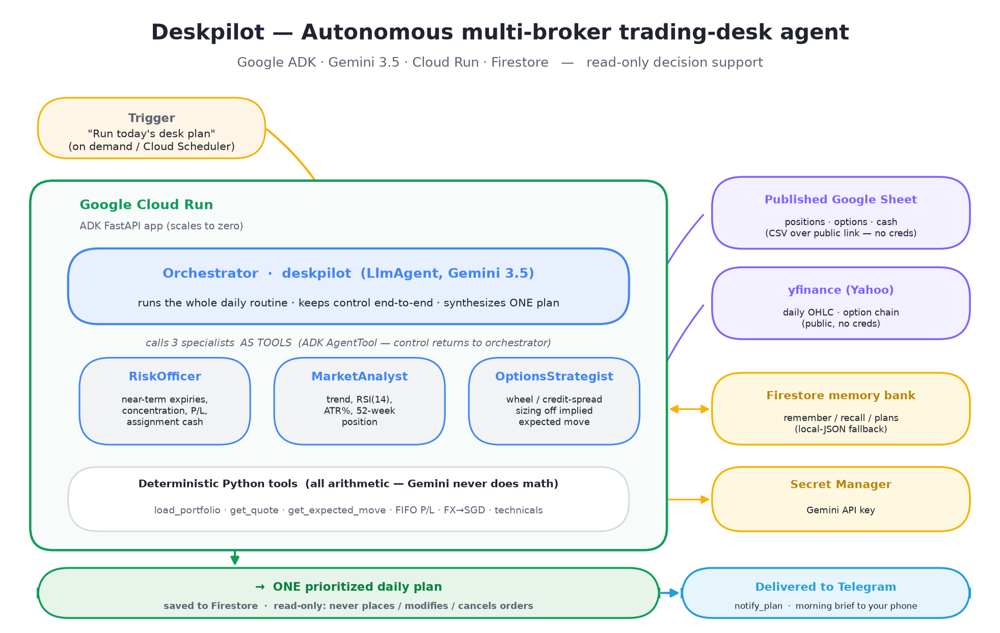

# Deskpilot

**An autonomous operator for your personal, multi-broker trading desk.**

Deskpilot turns a synced multi-broker portfolio into one prioritized daily plan.
Every morning it recalls yesterday's intent, reviews the live book for risk,
reads the technicals on the names that need a decision, sizes any options-income
setups, writes a single plan back to memory, and delivers it to your phone via
Telegram — unattended.

> **Read-only decision support.** Deskpilot never places, modifies, or cancels an
> order and gives no personalized buy/sell advice. It surfaces setups and
> reasoning; you decide and execute.

Built for the **All Things Agentic Hackathon** (Taskmaster category — an
event-driven workflow with autonomous routing: the daily desk routine, run
start to finish without step-by-step guidance).

**Live demo:** https://deskpilot-1016762985649.asia-southeast1.run.app/dev-ui/
(pick the `deskpilot` app, send *"Run today's desk plan"*).

**Write-up:** https://blog.pancherry.com/deskpilot/



*One prompt → the orchestrator delegates to RiskOfficer, MarketAnalyst and
OptionsStrategist, recalls and updates memory, then saves the day's plan —
captured live from the hosted demo above.*



---

## What it is (the agentic part)

Deskpilot is a **Google ADK** multi-agent system. An Orchestrator calls three
specialists *as tools* (ADK `AgentTool`) and stays in control for the whole run,
all running on **Gemini (≥ 3.5)**:

| Agent | Role | Tools |
|---|---|---|
| **deskpilot** (Orchestrator) | Runs the daily routine, delegates, synthesizes the plan | `load_portfolio`, `remember`, `recall`, `save_daily_plan`, `get_last_plan`, `notify_plan` |
| **RiskOfficer** | Reviews the live book: near-term expiries, concentration, P/L | `load_portfolio` |
| **MarketAnalyst** | Technical read per ticker (trend, RSI, ATR%, 52w position) | `get_quote` |
| **OptionsStrategist** | Sizes wheel / credit-spread income using implied expected move | `get_quote`, `get_expected_move` |

State persists in a **Firestore** memory bank (with a local-JSON fallback for
offline demos). Served on **Cloud Run** via ADK's FastAPI app. A run ends by
delivering the finished plan to **Telegram** (`notify_plan`) so the morning brief
lands on your phone — a graceful no-op when Telegram isn't configured.

**Built to run unattended.** Every market and notify tool returns an error dict
instead of raising, the memory bank falls back to local JSON when Firestore is
unavailable, and the runner **auto-retries transient Gemini `503`s** (high-demand
spikes) with exponential backoff — so a busy moment or a flaky feed never crashes
a run.

## Mandatory tech (all three satisfied)

- **Gemini 3.5+** — every agent's model (`DESKPILOT_MODEL`), via Gemini API or Vertex AI.
- **Google Agent Framework** — Google ADK (`google-adk`), multi-agent orchestration.
- **Google Cloud infra** — Cloud Run (serving) + Firestore (memory bank).

## Where positions come from (a Google Sheet)

Deskpilot reads your current book from a **published Google Sheet** — read as CSV
over its public link, so **no credentials are required** and anyone (including a
reviewer with their own sheet) can point Deskpilot at their data by setting one
env var, `DESKPILOT_PORTFOLIO_CSV_URL`.

```
Google Sheet (published CSV)  →  load_portfolio  →  Deskpilot (ADK + Gemini)  →  daily plan (Firestore)
   (you keep it updated)          (normalize)          (agentic reasoning)
```

Set it up:
1. Build a sheet with the columns in [`data/portfolio_template.csv`](data/portfolio_template.csv)
   (one row per holding; a `kind` column marks each row as `position`, `option`,
   or `cash`).
2. **File → Share → Publish to web →** choose the tab **→ CSV → Publish**.
3. Put that `…/pub?…&output=csv` link in `DESKPILOT_PORTFOLIO_CSV_URL`.

When the env var is unset, Deskpilot uses the shipped JSON sample, so it runs with
no network or credentials (this is what the tests use). You can keep the sheet
current by hand, or feed it from any pipeline you already run.

## Deliver the plan to Telegram (optional)

Each run ends by pushing the finished plan to a Telegram chat, so the morning
brief lands on your phone. It's optional — when unset, delivery is skipped and the
run still succeeds.

1. Create a bot with **@BotFather** and copy its token.
2. Send your bot any message, then get your chat id from **@userinfobot** (for a
   private chat, the chat id is your own user id — not the bot's).
3. Set both in your `.env` (or as Cloud Run secrets/env — see [DEPLOY.md](DEPLOY.md)):
   ```bash
   TELEGRAM_BOT_TOKEN=123456:ABC-your-bot-token
   TELEGRAM_CHAT_ID=123456789
   ```

`notify_plan` is outbound-only — it sends a message and nothing else, consistent
with Deskpilot being read-only.

## Quickstart (local)

Requires **Python 3.11+**. On macOS/Linux use `python`; on Windows use the
launcher `py -3.14` (any 3.11+ interpreter that has the deps works).

```bash
pip install -r requirements.txt
cp .env.example .env          # then fill in GOOGLE_API_KEY + DESKPILOT_MODEL
pytest -q                     # tools + memory tests (no key/network needed)
python -m deskpilot.run "Run today's desk plan"   # needs a valid Gemini key
```

Or use the ADK dev UI locally:

```bash
python server.py              # http://localhost:8080/dev-ui/
```

## Reproducible tests

The suite is **deterministic — no API key, no network, no credentials** — so a
reviewer can verify it on a clean checkout:

```bash
pip install -r requirements.txt
pytest -q                     # expect: 11 passed
```

The 11 tests (in [`tests/test_tools.py`](tests/test_tools.py)) cover the logic that
runs before any LLM call:

- **Market tools** — RSI/SMA math, and `_num` sanitizing `NaN`/`inf`/`None` to
  valid JSON (otherwise Gemini rejects the tool result with a 400).
- **Portfolio** — parsing a published-Sheet CSV into a snapshot: `kind` routing,
  type coercion, comma-formatted cash, derived `unrealized_pl` and `days_to_expiry`.
- **Resilience** — `get_quote` returns an error dict instead of raising when
  yfinance fails, and `load_portfolio` errors cleanly on a missing snapshot.
- **Notifications** — `notify_plan` skips cleanly when Telegram is unconfigured,
  and caps the message at Telegram's 4096-char limit when it is.
- **Memory** — `remember`/`recall`/`save_daily_plan`/`get_last_plan` round-trip
  against the local backend (no GCP project needed).

## Deploy to Cloud Run

One-command source deploy (Firestore memory + Gemini via Secret Manager). Full
walkthrough — enabling APIs, creating Firestore, storing the key, IAM — is in
[DEPLOY.md](DEPLOY.md). The hosted demo above was deployed this way.

## Layout

```
Deskpilot/
├─ deskpilot/
│  ├─ agent.py         # ADK Orchestrator + 3 specialists (root_agent)
│  ├─ config.py        # env-driven config (model, auth, paths)
│  ├─ run.py           # CLI runner (streams tool calls + final plan)
│  ├─ tools/
│  │  ├─ market.py     # get_quote, get_expected_move (yfinance)
│  │  ├─ portfolio.py  # load_portfolio (published Google Sheet CSV → snapshot)
│  │  └─ notify.py     # notify_plan (deliver the plan to Telegram)
│  └─ memory/store.py  # Firestore memory bank + local fallback
├─ server.py           # Cloud Run entrypoint (ADK FastAPI app)
├─ data/               # portfolio_template.csv + JSON sample fallback
├─ tests/              # deterministic unit tests
├─ Dockerfile
├─ DEPLOY.md           # Cloud Run + Firestore deploy
└─ docs/architecture.md
```

## License / disclosure

Personal hackathon project (All Things Agentic — Taskmaster track). It is a **new
project** built during the submission window; all agent, tool, memory, serving,
deploy, and test code here was written for this submission. Its data source is a
published Google Sheet, so it has **no runtime dependency** on any of the author's
other systems — a reviewer can point it at their own sheet with one env var. The
author populates their own sheet from a pre-existing project, `broker-portfolio-sync`
(prior work, not part of this repo), but that is an optional data-prep convenience,
not a component of Deskpilot. No credentials are committed; see `.gitignore`.
